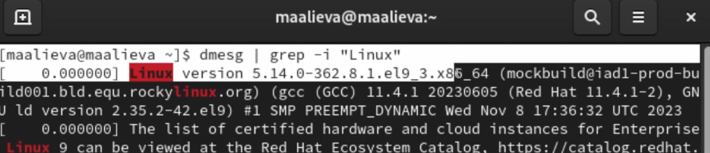
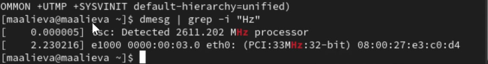
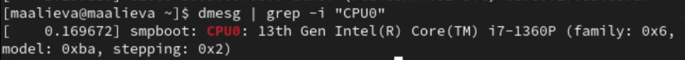
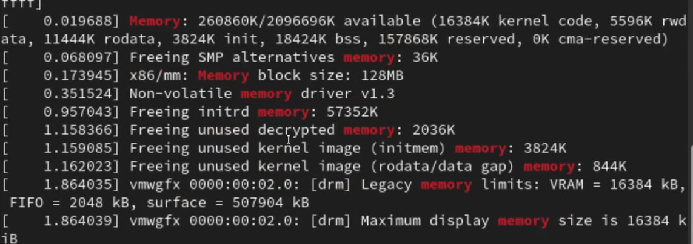
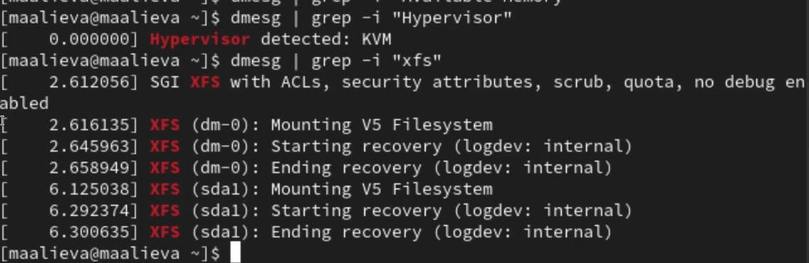

---
## Front matter
lang: ru-RU
title: Лабораторная работа №1
subtitle: Установка и конфигурация операционной системы на виртуальную машину
author:
  - Алиева Милена Арифовна
institute:
  - Российский университет дружбы народов, Москва, Россия

## i18n babel
babel-lang: russian
babel-otherlangs: english

## Formatting pdf
toc: false
toc-title: Содержание
slide_level: 2
aspectratio: 169
section-titles: true
theme: metropolis
header-includes:
 - \metroset{progressbar=frametitle,sectionpage=progressbar,numbering=fraction}
 - '\makeatletter'
 - '\beamer@ignorenonframefalse'
 - '\makeatother'
---

# Содержание 

1. Цель
2. Задания
3. Порядок выполнения
4. Вывод

# Цель

Целью данной работы является приобретение практических навыков установки операционной системы на виртуальную машину, настройки минимально необходимых для дальнейшей работы сервисов.

# Задание

Установить на виртуальную машину VirtualBox операционную систему Linux (дистрибутив Rocky)

# Порядок выполнения

1. Скачали VirtualBox, дистрибутив Rocky. Задали имя ОС, размер памяти, а также размер виртуального динамического жёсткого диска. Подключили образ диска и запустили виртуальную машину. Указали язык, дату и время, место установки

2. Отключили KDUMP, задали имя и сеть узла

3. Установили пароль для пользователя с правами администратора

4. Установили пароль для root, затем дождались установки, подключили образ диска дополнений гостевой ОС

# Порядок выполнения

5. С помощью команды grep получили некоторую информацию: 

{#fig:005 width=70%}

{#fig:006 width=70%}

{#fig:007 width=70%}

{#fig:008 width=70%}

{#fig:009 width=70%}

# Выводы

В результате выполнения лабораторной работы №1 я приобрела практические навыки установки операционной системы на виртуальную машину, а также навыки настройки минимально необходимых для дальнейшей работы сервисов.
