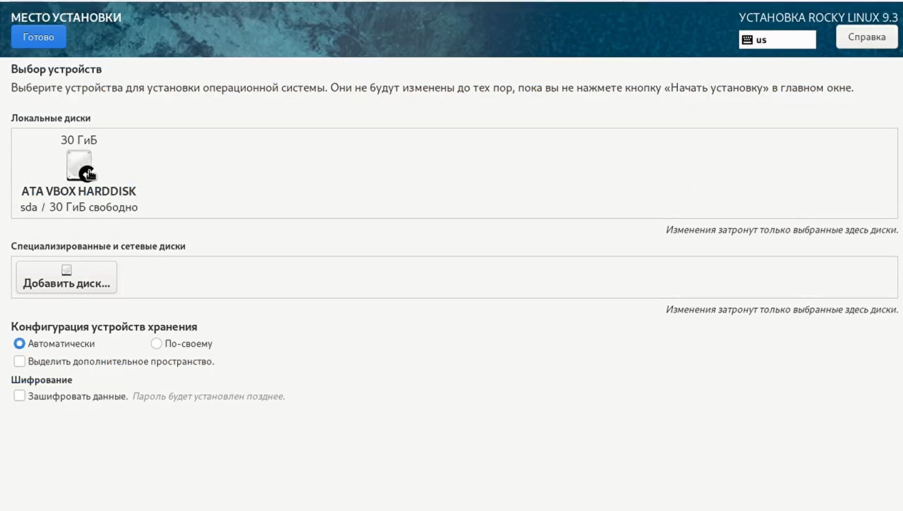
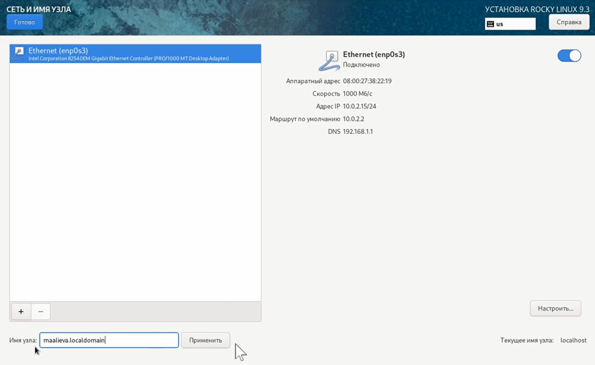
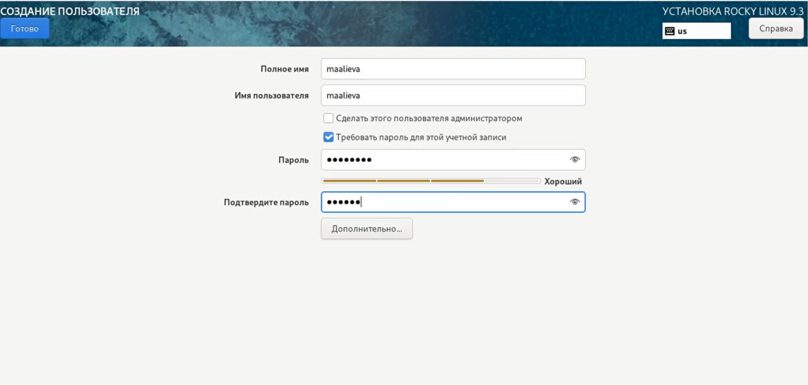
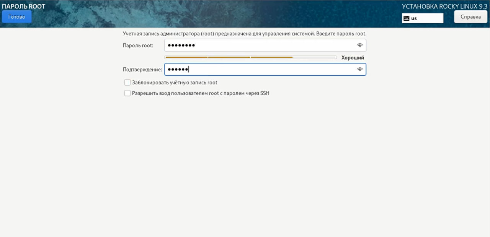
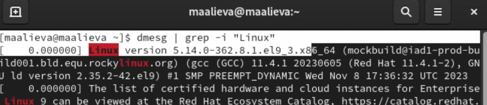
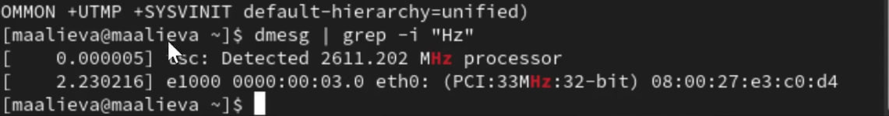
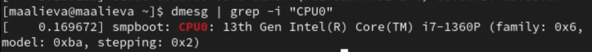
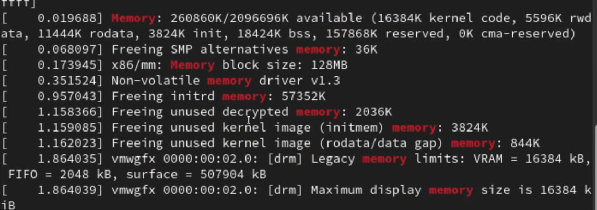
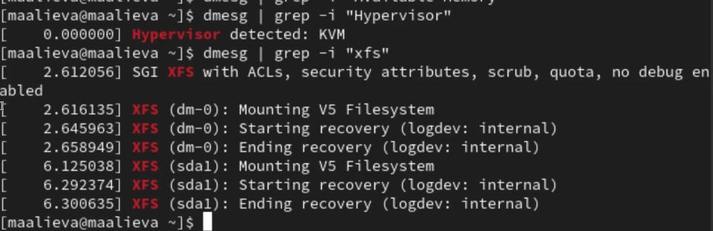

---
## Front matter
title: "Лабораторная работа №1"
subtitle: "Установка и конфигурация операционной системы на виртуальную машину"
author: "Алиева Милена Арифовна"

## Generic otions
lang: ru-RU
toc-title: "Содержание"

## Bibliography
bibliography: bib/cite.bib
csl: pandoc/csl/gost-r-7-0-5-2008-numeric.csl

## Pdf output format
toc: true # Table of contents
toc-depth: 2
lof: true # List of figures
lot: true # List of tables
fontsize: 12pt
linestretch: 1.5
papersize: a4
documentclass: scrreprt
## I18n polyglossia
polyglossia-lang:
  name: russian
  options:
  - spelling=modern
  - babelshorthands=true
polyglossia-otherlangs:
  name: english
## I18n babel
babel-lang: russian
babel-otherlangs: english
## Fonts
mainfont: PT Serif
romanfont: PT Serif
sansfont: PT Sans
monofont: PT Mono
mainfontoptions: Ligatures=TeX
romanfontoptions: Ligatures=TeX
sansfontoptions: Ligatures=TeX,Scale=MatchLowercase
monofontoptions: Scale=MatchLowercase,Scale=0.9
## Biblatex
biblatex: true
biblio-style: "gost-numeric"
biblatexoptions:
  - parentracker=true
  - backend=biber
  - hyperref=auto
  - language=auto
  - autolang=other*
  - citestyle=gost-numeric
## Pandoc-crossref LaTeX customization
figureTitle: "Рис."
tableTitle: "Таблица"
listingTitle: "Листинг"
lofTitle: "Список иллюстраций"
lotTitle: "Список таблиц"
lolTitle: "Листинги"
## Misc options
indent: true
header-includes:
  - \usepackage{indentfirst}
  - \usepackage{float} # keep figures where there are in the text
  - \floatplacement{figure}{H} # keep figures where there are in the text
---

# Цель работы

Целью данной работы является приобретение практических навыков установки операционной системы на виртуальную машину, настройки минимально необходимых для дальнейшей работы сервисов.

# Задание

Установить на виртуальную машину VirtualBox операционную систему Linux (дистрибутив Rocky)

# Теоретическое введение

Операционная система (ОС) — это комплекс взаимосвязанных программ, предназначенных для управления ресурсами компьютера и организации взаимодействия с пользователем. GNU Linux — семейство переносимых, многозадачных и многопользовательских операционных систем, на базе ядра Linux, включающих тот или иной набор утилит и программ проекта GNU, и, возможно, другие компоненты. Дистрибутив GNU Linux — общее определение ОС, использующих ядро Linux и набор библиотек и утилит, выпускаемых в рамках проекта GNU, а также графическую оконную подсистему X Window System.

# Выполнение лабораторной работы

1. Скачали VirtualBox, дистрибутив Rocky. Задали имя ОС, размер памяти, а также размер виртуального динамического жёсткого диска. Подключили образ диска и запустили виртуальную машину. Указали язык, дату и время, место установки. (рис. [-@fig:001]).

{#fig:001 width=70%}

2. Отключили KDUMP, задали имя и сеть узла (рис. [-@fig:002]).

{#fig:002 width=70%}

3. Установили пароль для пользователя с правами администратора (рис. [-@fig:003]).

{#fig:003 width=70%}

4. Установили пароль для root, затем дождались установки, подключили образ диска дополнений гостевой ОС (рис. [-@fig:004]).

{#fig:004 width=70%}

5. С помощью команды grep получили некоторую информацию: 

{#fig:005 width=70%}

{#fig:006 width=70%}

{#fig:007 width=70%}

{#fig:008 width=70%}

{#fig:009 width=70%}

# Ответы на контрольные вопросы

1. Какую информацию содержит учётная запись пользователя? 

Имя пользователя, зашифрованный пароль пользователя, идентификационный номер пользователя, домашний каталог пользователя, командный интерпретатор пользователя, идентификационный номер группы пользователя.

2. Укажите команды терминала:

а) для получения справки по команде: man <название команды> б) для перемещения по файловой системе: cd в) для просмотра содержимого каталога: ls г) для определения объёма каталога: du <название каталога> д) для создания каталогов: mkdir <имя каталога> для удаления каталогов: rm <имя каталога> для создания файлов: touch <имя файла> для удаления файлов: rm -r <имя файла> е) для задания определённых прав на файл / каталог: chmod + x <имя файла/каталога> ж) для просмотра истории команд: history

3. Что такое файловая система? Приведите примеры с краткой характеристикой. 

Файловая система - часть операционной системы назначений которой в том, чтобы обеспечить пользователю удобный интерфейс при работе с данными, хранящимися на диске.

Примеры файловых систем: Ext2, Ext 3, Ext4 - стандартная файловая система Linux XFS - высокопроизводительная файловая система, ее преимущество в высокой скорости работы с большими файлами, отложенном выделении места и в быстром увеличении разделов

4. Как посмотреть, какие файловые системы подмонтированы в ОС? 

Это делается с помощью команды mount

5. Как удалить зависший процесс? 

С помощью команды kill

# Выводы

В результате выполнения лабораторной работы №1 я приобрела практические навыки установки операционной системы на виртуальную машину, а также навыки настройки минимально необходимых для дальнейшей работы сервисов.
