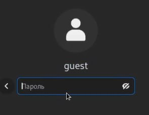
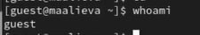
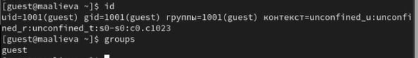
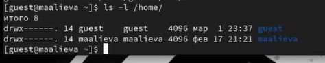
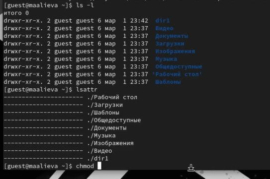
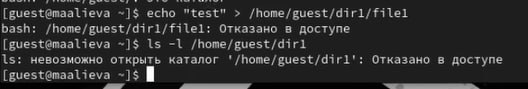
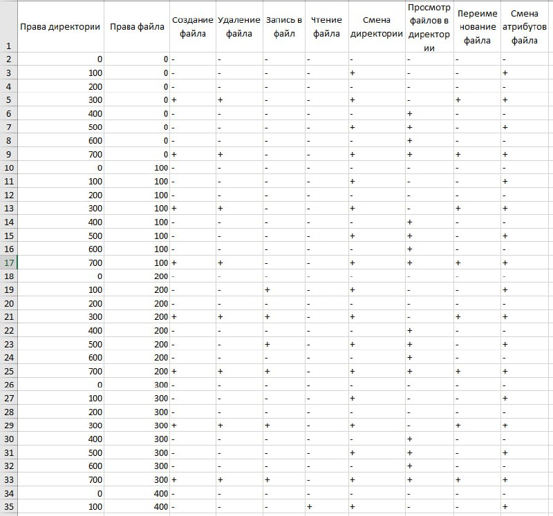
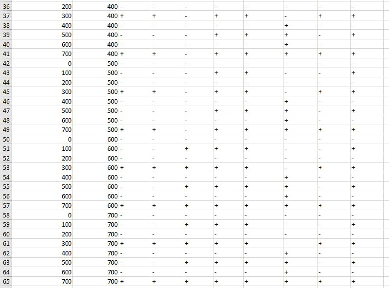
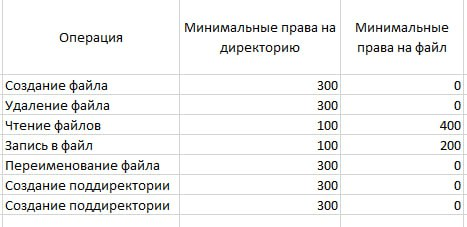

---
## Front matter
lang: ru-RU
title: Лабораторная работа №2
subtitle: Дискреционное разграничение прав в Linux. Основные атрибуты
author:
  - Алиева Милена Арифовна
institute:
  - Российский университет дружбы народов, Москва, Россия

## i18n babel
babel-lang: russian
babel-otherlangs: english

## Formatting pdf
toc: false
toc-title: Содержание
slide_level: 2
aspectratio: 169
section-titles: true
theme: metropolis
header-includes:
 - \metroset{progressbar=frametitle,sectionpage=progressbar,numbering=fraction}
 - '\makeatletter'
 - '\beamer@ignorenonframefalse'
 - '\makeatother'
---

# Содержание 

1. Цель
2. Задания
3. Порядок выполнения
4. Вывод

# Цель

Целью данной работы является получение практических навыков работы в консоли с атрибутами файлов, закрепление теоретических основ дискреционного разграничения доступа в современных системах с открытым кодом на базе ОС Linux

# Задание

1. Создать учётную запись guest
2. Создать каталог dir1, выполнить некоторые операции с ним
3. Заполнить две таблицы - "Установленные права и разрешённые действия" и "Минимальные права для совершения операций"

# Порядок выполнения

1. Cоздали учётную запись пользователя guest, создали пароль для этой учётной записи 

2. Вошли в систему от имени пользователя guest

{#fig:002 width=70%}

# Порядок выполнения

3. Определили, в какой директории мы находимся, используя команду pwd, убедились, что находимся в домашней директории 

4. Уточнили имя пользователя командой whoami 

{#fig:004 width=70%}

# Порядок выполнения

5. Уточнили имя пользователя, его группу, а также группы, куда входит пользователь, командой id. Сравнили с выводом команды groups, вывод совпал

{#fig:005 width=70%}

6. Просмотрели файл /etc/passwd командой cat /etc/passwd, нашли в нем свою учетную запись, всё совпало с предыдущими выводами 

# Порядок выполнения

7. Определили существующие в системе директории с помощью команды ls -l /home/

{#fig:007 width=70%}

8. Проверили, какие расширенные атрибуты установлены на поддиректориях, находящихся в директории /home, командой: lsattr /home 

# Порядок выполнения

9. Создали в домашней директории поддиректорию dir1. Определили командами ls -l и lsattr, какие права доступа и расширенные атрибуты были выставлены на директорию dir1. Сняли с директории dir1 все атрибуты командой chmod 000 dir1 и проверили её правильность с помощью команды ls -s 

{#fig:008 width=70%}

# Порядок выполнения

10. Создали в директории dir1 файл file1 командой echo "test" > /home/guest/dir1/file1, но нам было отказано в доступе 

{#fig:009 width=70%}

# Порядок выполнения 

11. Заполненная таблица «Установленные права и разрешённые действия»

{#fig:011 width=70%} 

{#fig:012 width=70%}

# Порядок выполнения  

12. Заполненная таблица "Минимальные права для совершения операций" 

{#fig:014 width=70%}

# Выводы

В результате выполнения данной лабораторной работы я получила практические навыки работы в консоли с атрибутами файлов, закрепила теоретических основ дискреционного разграничения доступа в современных системах с открытым кодом на базе ОС Linux
