---
## Front matter
title: "Лабораторная работа №2"
subtitle: "Дискреционное разграничение прав в Linux. Основные атрибуты"
author: "Алиева Милена Арифовна"

## Generic otions
lang: ru-RU
toc-title: "Содержание"

## Bibliography
bibliography: bib/cite.bib
csl: pandoc/csl/gost-r-7-0-5-2008-numeric.csl

## Pdf output format
toc: true # Table of contents
toc-depth: 2
lof: true # List of figures
lot: true # List of tables
fontsize: 12pt
linestretch: 1.5
papersize: a4
documentclass: scrreprt
## I18n polyglossia
polyglossia-lang:
  name: russian
  options:
  - spelling=modern
  - babelshorthands=true
polyglossia-otherlangs:
  name: english
## I18n babel
babel-lang: russian
babel-otherlangs: english
## Fonts
mainfont: PT Serif
romanfont: PT Serif
sansfont: PT Sans
monofont: PT Mono
mainfontoptions: Ligatures=TeX
romanfontoptions: Ligatures=TeX
sansfontoptions: Ligatures=TeX,Scale=MatchLowercase
monofontoptions: Scale=MatchLowercase,Scale=0.9
## Biblatex
biblatex: true
biblio-style: "gost-numeric"
biblatexoptions:
  - parentracker=true
  - backend=biber
  - hyperref=auto
  - language=auto
  - autolang=other*
  - citestyle=gost-numeric
## Pandoc-crossref LaTeX customization
figureTitle: "Рис."
tableTitle: "Таблица"
listingTitle: "Листинг"
lofTitle: "Список иллюстраций"
lotTitle: "Список таблиц"
lolTitle: "Листинги"
## Misc options
indent: true
header-includes:
  - \usepackage{indentfirst}
  - \usepackage{float} # keep figures where there are in the text
  - \floatplacement{figure}{H} # keep figures where there are in the text
---

# Цель работы

Получение практических навыков работы в консоли с атрибутами файлов, закрепление теоретических основ дискреционного разграничения доступа в современных системах с открытым кодом на базе ОС Linux

# Задание

1. Создать учётную запись guest
2. Создать каталог dir1, выполнить некоторые операции с ним
3. Заполнить две таблицы - "Установленные права и разрешённые действия" и "Минимальные права для совершения операций"

# Теоретическое введение

Операционная система (ОС) — это комплекс взаимосвязанных программ, предназначенных для управления ресурсами компьютера и организации взаимодействия с пользователем. GNU Linux — семейство переносимых, многозадачных и многопользовательских операционных систем, на базе ядра Linux, включающих тот или иной набор утилит и программ проекта GNU, и, возможно, другие компоненты. Дистрибутив GNU Linux — общее определение ОС, использующих ядро Linux и набор библиотек и утилит, выпускаемых в рамках проекта GNU, а также графическую оконную подсистему X Window System.

# Выполнение лабораторной работы

1.  Cоздали учётную запись пользователя guest, создали пароль для этой учётной записи (рис. [-@fig:001]).

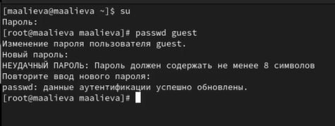{#fig:001 width=70%}

2. Вошли в систему от имени пользователя guest. (рис. [-@fig:002]).

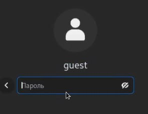{#fig:002 width=70%}

3. Определили, в какой директории мы находимся, используя команду pwd, убедились, что находимся в домашней директории (рис. [-@fig:003]).

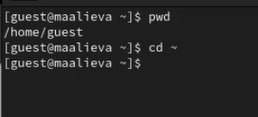{#fig:003 width=70%}

4. Уточнили имя пользователя командой whoami (рис. [-@fig:004]).

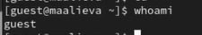{#fig:004 width=70%}

5. Уточнили имя пользователя, его группу, а также группы, куда входит пользователь, командой id. Сравнили с выводом команды groups, вывод совпал (рис. [-@fig:005]).

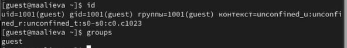{#fig:005 width=70%}

6. Просмотрели файл /etc/passwd командой cat /etc/passwd, нашли в нем свою учетную запись, всё совпало с предыдущими выводами (рис. [-@fig:006]).

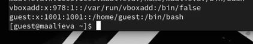{#fig:006 width=70%}

7. Определили существующие в системе директории с помощью команды ls -l /home/. Проверили, какие расширенные атрибуты установлены на поддиректориях, находящихся в директории /home, командой: lsattr /home (рис. [-@fig:007]).

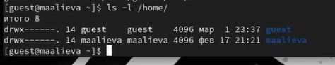{#fig:007 width=70%}

8. Создали в домашней директории поддиректорию dir1. Определили командами ls -l и lsattr, какие права доступа и расширенные атрибуты были выставлены на директорию dir1. Сняли с директории dir1 все атрибуты командой chmod 000 dir1 и проверили её правильность с помощью команды ls -s (рис. [-@fig:008]).

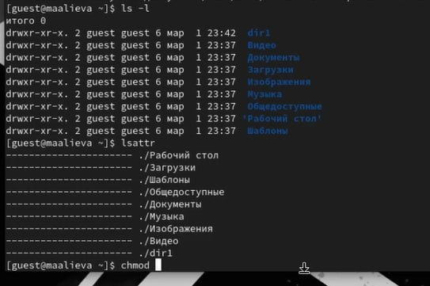{#fig:008 width=70%}

9. Создали в директории dir1 файл file1 командой echo "test" > /home/guest/dir1/file1, но нам было отказано в доступе (рис. [-@fig:009]).

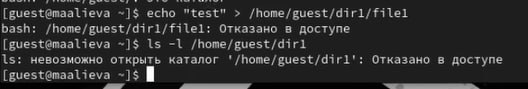{#fig:009 width=70%}

10. Начали заполнение таблицы «Установленные права и разрешённые действия» (рис. [-@fig:010]).

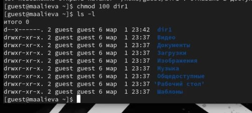{#fig:010 width=70%}

11. Заполненная таблица «Установленные права и разрешённые действия»

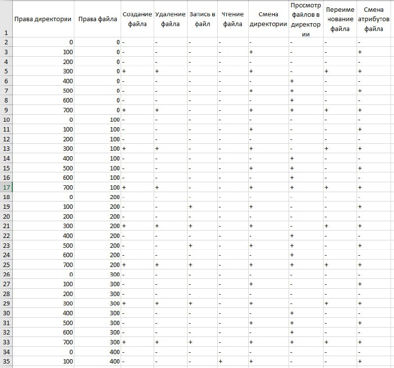{#fig:011 width=70%} 

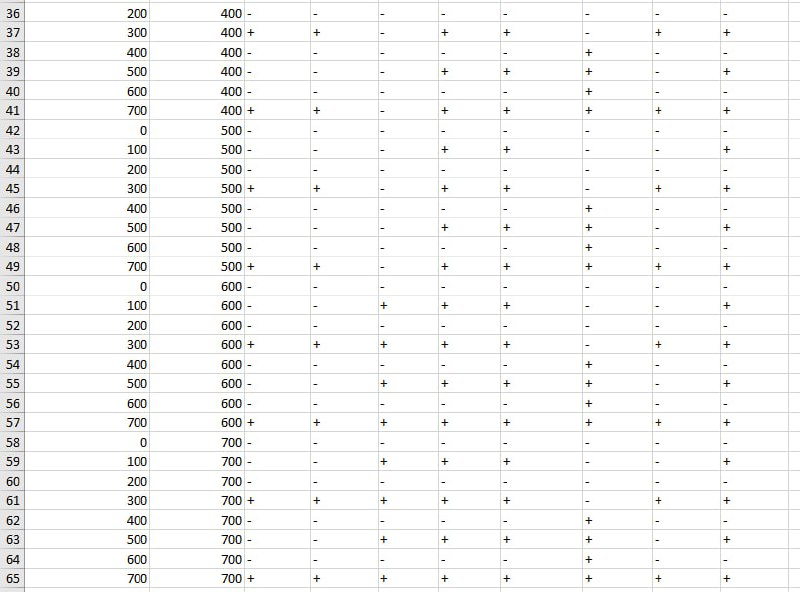{#fig:012 width=70%}

12. Начали заполнение таблицы "Минимальные права для совершения операций" (рис. [-@fig:013]).

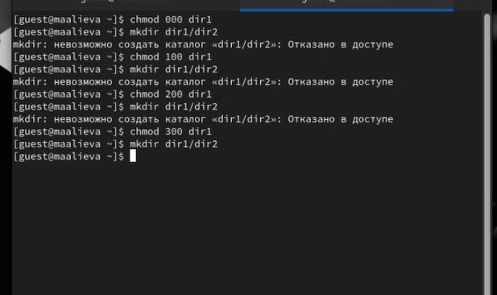{#fig:013 width=70%}

13. Заполненная таблица "Минимальные права для совершения операций" (рис. [-@fig:014]).

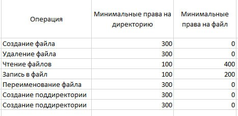{#fig:014 width=70%}

# Выводы

В результате выполнения данной лабораторной работы я получила практические навыки работы в консоли с атрибутами файлов, закрепила теоретических основ дискреционного разграничения доступа в современных системах с открытым кодом на базе ОС Linux

