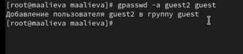
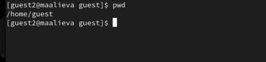
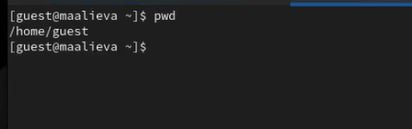
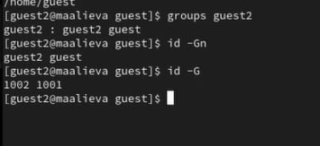
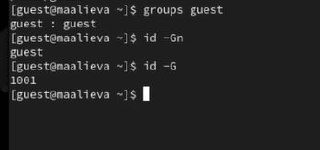
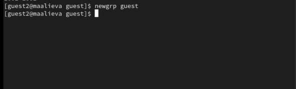
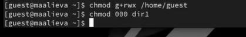
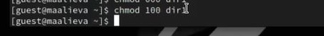

---
## Front matter
lang: ru-RU
title: Лабораторная работа №3
subtitle: Дискреционное разграничение прав в Linux. Два пользователя
author:
  - Алиева Милена Арифовна
institute:
  - Российский университет дружбы народов, Москва, Россия

## i18n babel
babel-lang: russian
babel-otherlangs: english

## Formatting pdf
toc: false
toc-title: Содержание
slide_level: 2
aspectratio: 169
section-titles: true
theme: metropolis
header-includes:
 - \metroset{progressbar=frametitle,sectionpage=progressbar,numbering=fraction}
 - '\makeatletter'
 - '\beamer@ignorenonframefalse'
 - '\makeatother'
---

# Содержание 

1. Цель
2. Задания
3. Порядок выполнения
4. Вывод

# Цель

Целью данной работы является получение практических навыков работы в консоли с атрибутами файлов для групп пользователей

# Задание

1. Создать учётную запись guest2
2. Меняя атрибуты у директории dir1, заполнить две таблицы - "Установленные права и разрешённые действия для групп" и "Минимальные права для совершения операций от имени пользователя входящих в группу"

# Порядок выполнения

1. Cоздали учётную запись пользователя guest2, создали пароль для этой учётной записи 

2. Добавили пользователя guest2 в группу guest 

{#fig:002 width=70%}

# Порядок выполнения

3. Осуществили вход в систему от двух пользователей на двух разных консолях: guest на первой консоли и guest2 на второй консоли

4. Для обоих пользователей командой pwd определили директорию, в которой мы находимся 

{#fig:004 width=70%}

{#fig:005 width=70%}

# Порядок выполнения

5. Уточнили имя пользователя, его группу, кто входит в неё и к каким группам принадлежит. Определили командами groups guest и groups guest2, в какие группы входят пользователи guest и guest2. Сравнили вывод команды groups с выводом команд id -Gn и id -G

{#fig:006 width=70%}

{#fig:007 width=70%}

# Порядок выполнения

6. Просмотрели файл /etc/passwd командой cat /etc/passwd, нашли в нем свою учетную запись, всё совпало с предыдущими выводами 

7. От имени пользователя guest2 выполнили регистрацию пользователя guest2 в группе guest 

{#fig:009 width=70%}

# Порядок выполнения

8. От имени пользователя guest изменили права директории /home/guest, разрешив все действия для пользователей группы 

{#fig:010 width=70%}

9. От имени пользователя guest сняли с директории /home/guest/dir1 все атрибуты 

{#fig:011 width=70%} 

# Порядок выполнения

10. Меняя атрибуты у директории dir1 и файла file1 от имени пользователя guest и делая проверку от пользователя guest2, заполнили таблицу 3.1, определивли опытным путём, какие операции разрешены, а какие нет. Сравнивая таблицу 3.1. с таблицей 2.1, можно сказать, что они одинаковы, но есть различие в том, что в предыдущий раз мы присваивали права владельцу, а в этот раз группе.

# Выводы

В результате выполнения данной лабораторной работы я получила практические навыки работы в консоли с атрибутами файлов для групп пользователей
