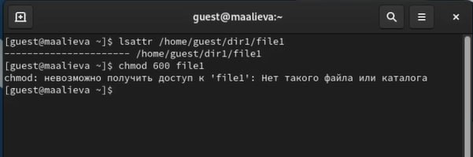
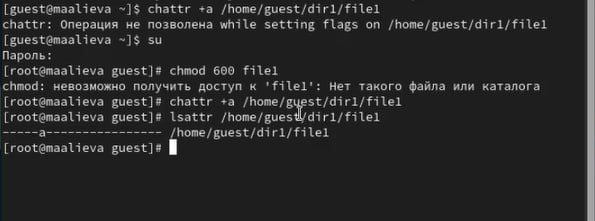
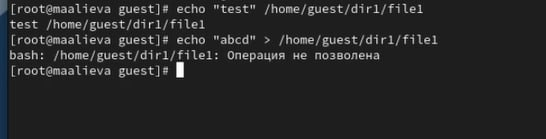
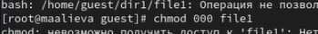
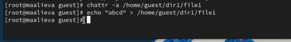
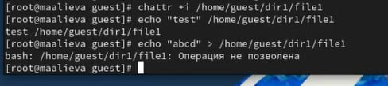

---
## Front matter
lang: ru-RU
title: Лабораторная работа №4
subtitle: Дискреционное разграничение прав в Linux. Расширенные атрибуты
author:
  - Алиева Милена Арифовна
institute:
  - Российский университет дружбы народов, Москва, Россия

## i18n babel
babel-lang: russian
babel-otherlangs: english

## Formatting pdf
toc: false
toc-title: Содержание
slide_level: 2
aspectratio: 169
section-titles: true
theme: metropolis
header-includes:
 - \metroset{progressbar=frametitle,sectionpage=progressbar,numbering=fraction}
 - '\makeatletter'
 - '\beamer@ignorenonframefalse'
 - '\makeatother'
---

# Содержание 

1. Цель
2. Задания
3. Порядок выполнения
4. Вывод

# Цель

Целью данной работы является получение практических навыков работы в консоли с расширенными атрибутами файлов

# Задание

Познакомиться на примерах с тем, как используются основные и расширенные атрибуты при разграничении доступа

# Порядок выполнения

1.  От имени пользователя guest определили расширенные атрибуты файла /home/guest/dir1/file1 командой lsattr /home/guest/dir1/file1, а затем установили командой chmod 600 file1 на файл file1 права, разрешающие чтение и запись для владельца файла. (рис. [-@fig:001]).

{#fig:001 width=70%}

# Порядок выполнения

2. Установили на файл /home/guest/dir1/file1 расширенный атрибут a от имени пользователя guest. В ответ получили отказ от выполнения операции. Зашли с правами администратора, повысив свои права с помощью команды su. И установили расширенный атрибут a на файл /home/guest/dir1/file1 от имени суперпользователя. Затем от пользователя guest проверили правильность установления атрибута (рис. [-@fig:002]).

{#fig:002 width=70%}

# Порядок выполнения

3. Выполнили дозапись в файл file1 слова «test» командой echo, после этого выполнили чтение файла и убедились, что слово test было успешно записано в file1.
Затем попробовали стереть имеющуюся в нём информацию (рис. [-@fig:003]).

{#fig:003 width=70%}

# Порядок выполнения

4. Установили на файл file1 права запрещающие чтение и запись для владельца файла (рис. [-@fig:004]).

{#fig:004 width=70%}

# Порядок выполнения

5. Сняли расширенный атрибут a с файла /home/guest/dirl/file1 от имени суперпользователя командой. Затем повторили операции, которые ранее не удавалось выполнить. Теперь же получилось выполнить данные операции (рис. [-@fig:005]).

{#fig:005 width=70%}

# Порядок выполнения

6. Повторили действия по шагам, заменив атрибут a атрибутом i. Одна из операций осталась также недоступна (рис. [-@fig:006]).

{#fig:006 width=70%}

# Выводы

В результате выполнения данной лабораторной работы я получила практические навыки работы в консоли с расширенными атрибутами файлов.
