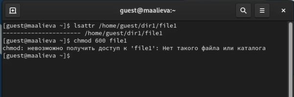
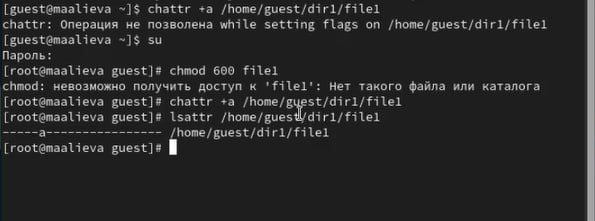
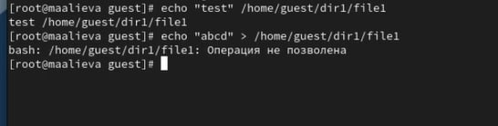
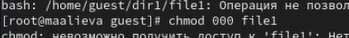
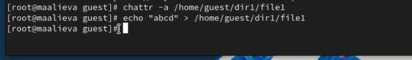
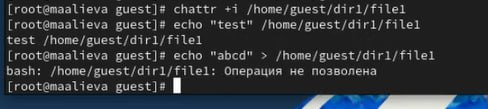

---
## Front matter
title: "Лабораторная работа №4"
subtitle: "Дискреционное разграничение прав в Linux. Расширенные атрибуты"
author: "Алиева Милена Арифовна"

## Generic otions
lang: ru-RU
toc-title: "Содержание"

## Bibliography
bibliography: bib/cite.bib
csl: pandoc/csl/gost-r-7-0-5-2008-numeric.csl

## Pdf output format
toc: true # Table of contents
toc-depth: 2
lof: true # List of figures
lot: true # List of tables
fontsize: 12pt
linestretch: 1.5
papersize: a4
documentclass: scrreprt
## I18n polyglossia
polyglossia-lang:
  name: russian
  options:
  - spelling=modern
  - babelshorthands=true
polyglossia-otherlangs:
  name: english
## I18n babel
babel-lang: russian
babel-otherlangs: english
## Fonts
mainfont: PT Serif
romanfont: PT Serif
sansfont: PT Sans
monofont: PT Mono
mainfontoptions: Ligatures=TeX
romanfontoptions: Ligatures=TeX
sansfontoptions: Ligatures=TeX,Scale=MatchLowercase
monofontoptions: Scale=MatchLowercase,Scale=0.9
## Biblatex
biblatex: true
biblio-style: "gost-numeric"
biblatexoptions:
  - parentracker=true
  - backend=biber
  - hyperref=auto
  - language=auto
  - autolang=other*
  - citestyle=gost-numeric
## Pandoc-crossref LaTeX customization
figureTitle: "Рис."
tableTitle: "Таблица"
listingTitle: "Листинг"
lofTitle: "Список иллюстраций"
lotTitle: "Список таблиц"
lolTitle: "Листинги"
## Misc options
indent: true
header-includes:
  - \usepackage{indentfirst}
  - \usepackage{float} # keep figures where there are in the text
  - \floatplacement{figure}{H} # keep figures where there are in the text
---

# Цель работы

Получение практических навыков работы в консоли с расширенными атрибутами файлов.

# Задание

Познакомиться на примерах с тем, как используются основные и расширенные атрибуты при разграничении доступа.

# Выполнение лабораторной работы

1.  От имени пользователя guest определили расширенные атрибуты файла /home/guest/dir1/file1 командой lsattr /home/guest/dir1/file1, а затем установили командой chmod 600 file1 на файл file1 права, разрешающие чтение и запись для владельца файла. (рис. [-@fig:001]).

{#fig:001 width=70%}

2. Установили на файл /home/guest/dir1/file1 расширенный атрибут a от имени пользователя guest. В ответ получили отказ от выполнения операции. Зашли с правами администратора, повысив свои права с помощью команды su. И установили расширенный атрибут a на файл /home/guest/dir1/file1 от имени суперпользователя. Затем от пользователя guest проверили правильность установления атрибута (рис. [-@fig:002]).

{#fig:002 width=70%}

3. Выполнили дозапись в файл file1 слова «test» командой echo, после этого выполнили чтение файла и убедились, что слово test было успешно записано в file1.
Затем попробовали стереть имеющуюся в нём информацию (рис. [-@fig:003]).

{#fig:003 width=70%}

4. Установили на файл file1 права запрещающие чтение и запись для владельца файла (рис. [-@fig:004]).

{#fig:004 width=70%}

5. Сняли расширенный атрибут a с файла /home/guest/dirl/file1 от имени суперпользователя командой. Затем повторили операции, которые ранее не удавалось выполнить. Теперь же получилось выполнить данные операции (рис. [-@fig:005]).

{#fig:005 width=70%}

6. Повторили действия по шагам, заменив атрибут a атрибутом i. Одна из операций осталась также недоступна (рис. [-@fig:006]).

{#fig:006 width=70%}

# Выводы

В результате выполнения данной лабораторной работы я получила практические навыки работы в консоли с расширенными атрибутами файлов
