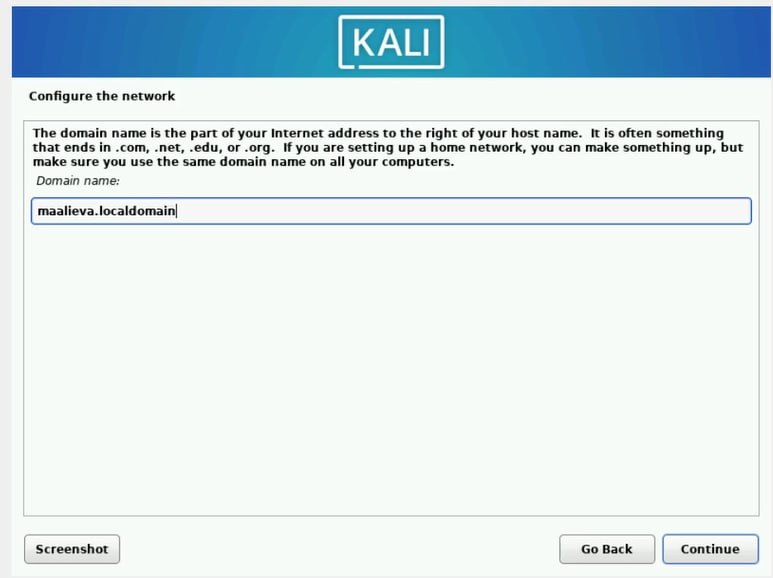
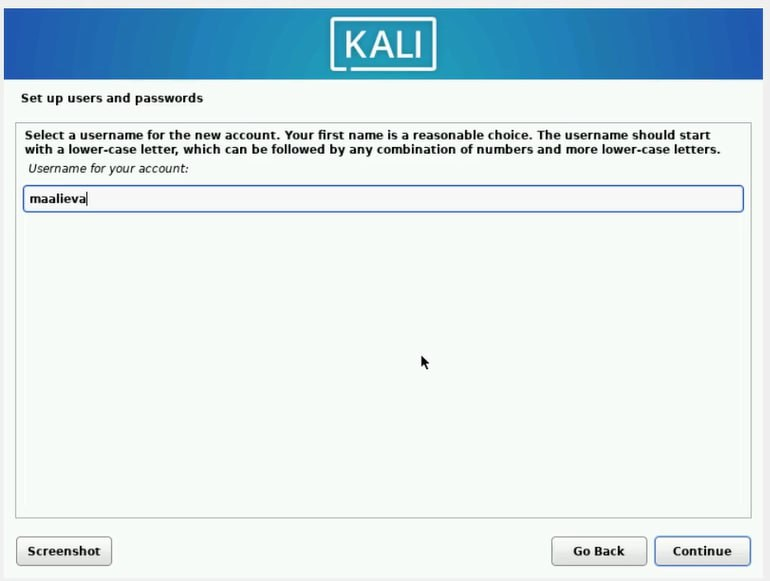
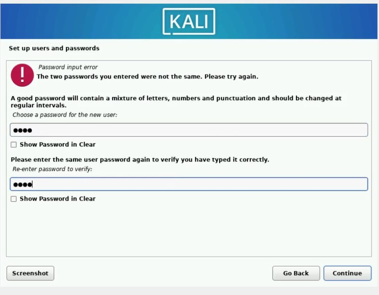
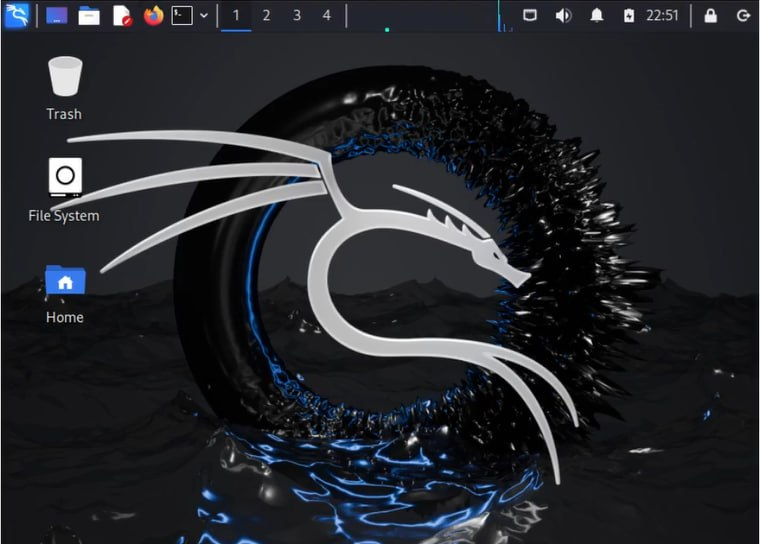

---
## Front matter
lang: ru-RU
title: Первый этап проекта
subtitle: Установка Kali Linux
author:
  - Алиева Милена Арифовна
institute:
  - Российский университет дружбы народов, Москва, Россия

## i18n babel
babel-lang: russian
babel-otherlangs: english

## Formatting pdf
toc: false
toc-title: Содержание
slide_level: 2
aspectratio: 169
section-titles: true
theme: metropolis
header-includes:
 - \metroset{progressbar=frametitle,sectionpage=progressbar,numbering=fraction}
 - '\makeatletter'
 - '\beamer@ignorenonframefalse'
 - '\makeatother'
---

# Содержание 

1. Цель
2. Задания
3. Порядок выполнения
4. Вывод

# Цель

Целью данной работы является приобретение практических навыков установки операционной системы на виртуальную машину, настройки минимально необходимых для дальнейшей работы сервисов.

# Задание

Установить на виртуальную машину VirtualBox операционную систему Linux (дистрибутив Kali)

# Порядок выполнения

1. Создали виртуальную машину, указали имя (Kali), тип (Linux) и версию (Debian (64-bit))

2. Подключили образ, скаченный с официального сайта, начали установку

# Порядок выполнения

3. Указали домен 

{#fig:003 width=70%}

4. Указали имя пользователя 

{#fig:004 width=70%}

# Порядок выполнения

5. Установили пароль для пользователя 

{#fig:005 width=70%}

6. Выбрали различные софты для установки (оставили рекомендованные) 

# Порядок выполнения

7. Успешно завершили установку Kali Linux 

{#fig:007 width=70%}

# Выводы

В результате выполнения лабораторной работы №1 я приобрела практические навыки установки операционной системы Kali Linux на виртуальную машину, а также навыки настройки минимально необходимых для дальнейшей работы сервисов.
