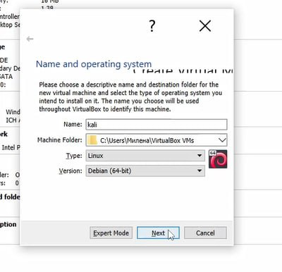
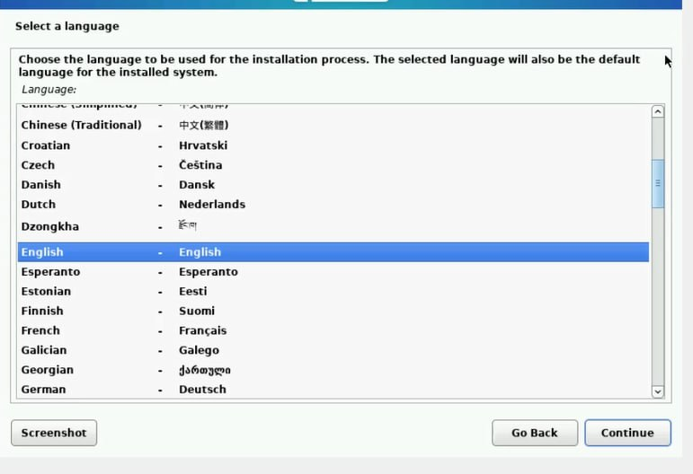
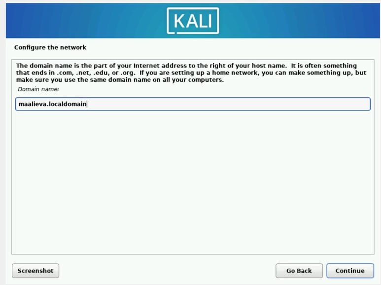
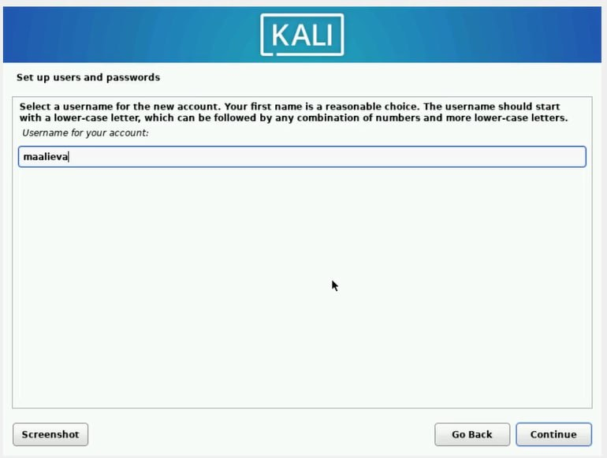
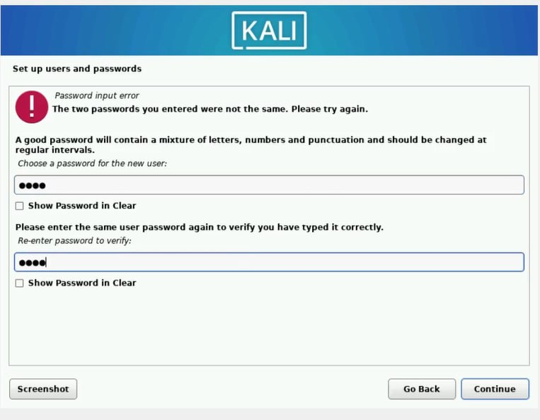
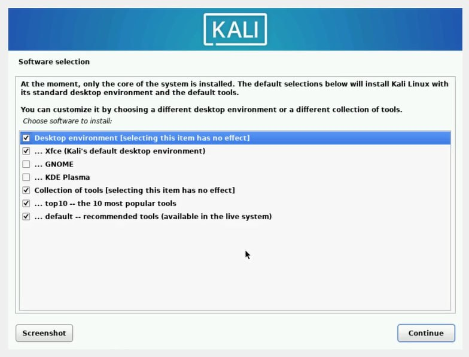
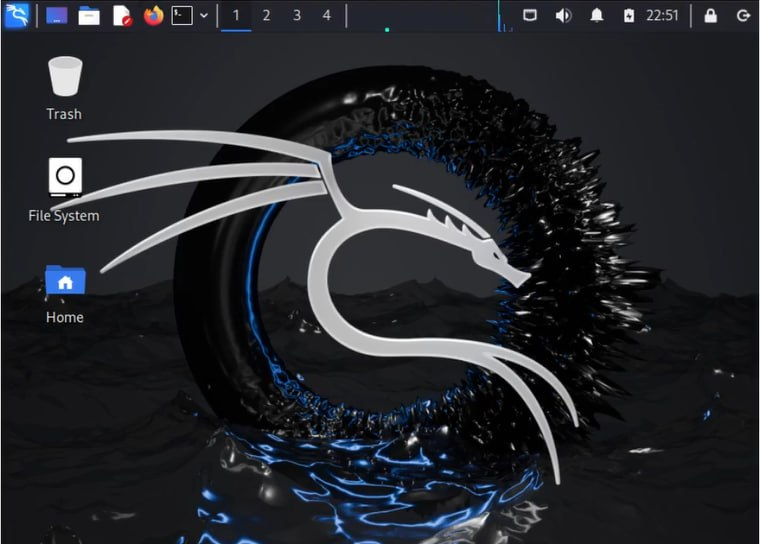

---
## Front matter
title: "Первый этап проекта"
subtitle: "Установка Kali Linux"
author: "Алиева Милена Арифовна"

## Generic otions
lang: ru-RU
toc-title: "Содержание"

## Bibliography
bibliography: bib/cite.bib
csl: pandoc/csl/gost-r-7-0-5-2008-numeric.csl

## Pdf output format
toc: true # Table of contents
toc-depth: 2
lof: true # List of figures
lot: true # List of tables
fontsize: 12pt
linestretch: 1.5
papersize: a4
documentclass: scrreprt
## I18n polyglossia
polyglossia-lang:
  name: russian
  options:
  - spelling=modern
  - babelshorthands=true
polyglossia-otherlangs:
  name: english
## I18n babel
babel-lang: russian
babel-otherlangs: english
## Fonts
mainfont: PT Serif
romanfont: PT Serif
sansfont: PT Sans
monofont: PT Mono
mainfontoptions: Ligatures=TeX
romanfontoptions: Ligatures=TeX
sansfontoptions: Ligatures=TeX,Scale=MatchLowercase
monofontoptions: Scale=MatchLowercase,Scale=0.9
## Biblatex
biblatex: true
biblio-style: "gost-numeric"
biblatexoptions:
  - parentracker=true
  - backend=biber
  - hyperref=auto
  - language=auto
  - autolang=other*
  - citestyle=gost-numeric
## Pandoc-crossref LaTeX customization
figureTitle: "Рис."
tableTitle: "Таблица"
listingTitle: "Листинг"
lofTitle: "Список иллюстраций"
lotTitle: "Список таблиц"
lolTitle: "Листинги"
## Misc options
indent: true
header-includes:
  - \usepackage{indentfirst}
  - \usepackage{float} # keep figures where there are in the text
  - \floatplacement{figure}{H} # keep figures where there are in the text
---

# Цель работы

Установить дистрибутив Kali Linux в виртуальную машину

# Задание

Установить на виртуальную машину VirtualBox операционную систему Linux (дистрибутив Kali)

# Теоретическое введение

Операционная система (ОС) — это комплекс взаимосвязанных программ, предназначенных для управления ресурсами компьютера и организации взаимодействия с пользователем. GNU Linux — семейство переносимых, многозадачных и многопользовательских операционных систем, на базе ядра Linux, включающих тот или иной набор утилит и программ проекта GNU, и, возможно, другие компоненты. Дистрибутив GNU Linux — общее определение ОС, использующих ядро Linux и набор библиотек и утилит, выпускаемых в рамках проекта GNU, а также графическую оконную подсистему X Window System.

# Выполнение лабораторной работы

1. Создали виртуальную машину, указали имя (Kali), тип (Linux) и версию (Debian (64-bit)). (рис. [-@fig:001]).

{#fig:001 width=70%}

2. Подключили образ, скаченный с официального сайта, начали установку. (рис. [-@fig:002]).

{#fig:002 width=70%}

3. Указали домен (рис. [-@fig:003]).

{#fig:003 width=70%}

4. Указали имя пользователя (рис. [-@fig:004]).

{#fig:004 width=70%}

5. Установили пароль для пользователя (рис. [-@fig:005]).

{#fig:005 width=70%}

6. Выбрали различные софты для установки (оставили рекомендованные) (рис. [-@fig:006]).

{#fig:006 width=70%}

7. Успешно завершили установку Kali Linux (рис. [-@fig:007]).

{#fig:007 width=70%}

# Выводы

В результате выполнения первого этапа проекта я научилась устанавливать на виртуальную машину VirtualBox операционную систему Linux (дистрибутив Kali)
